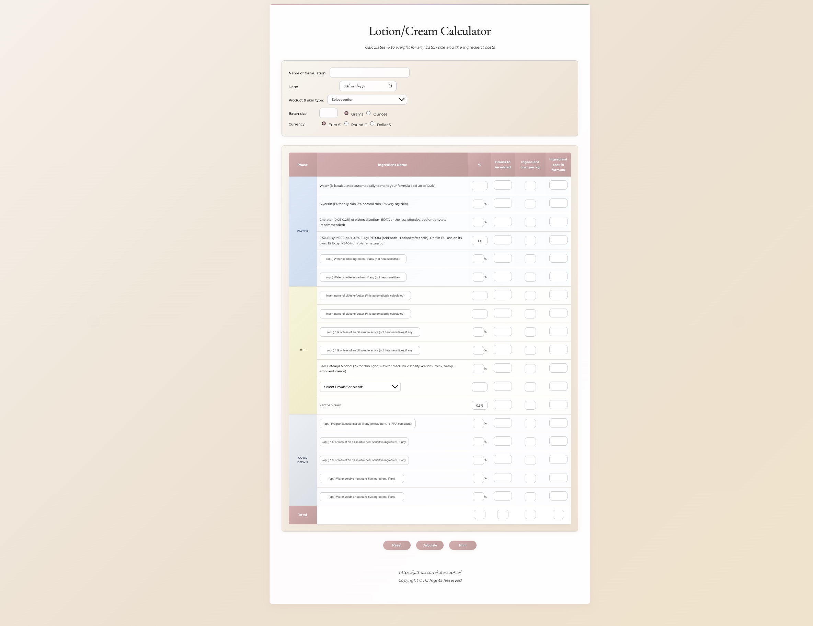

# DIY SkinCare Lotion and Cream Chemistry Calculator 

DIY Skincare Lotion and Cream Calculator made by Rute-Sophie for those who want to make their own skin lotions or creams in their personal lab at home.

## Screenshot

*The calculator features a modern, feminine design with soft pastel colors and an intuitive interface for formulating skincare products.*

## Features

- **Formulation Management**: Name and date your formulations
- **Skin Type Selection**: Choose from oily, normal, or dry skin formulations
- **Batch Size Calculator**: Calculate ingredients for any batch size in grams or ounces
- **Multi-Currency Support**: Euro €, Pound £, and Dollar $ support
- **Phase-Based Formulation**: Organized by Water, Oil, and Cool Down phases
- **Automatic Calculations**: Percentage to weight conversions and cost calculations
- **Ingredient Cost Tracking**: Track ingredient costs per kg and total formula cost
- **Professional Output**: Print-friendly format for your formulations

## How to Use

1. **Enter Formulation Details**: Add a name, date, and select your skin type
2. **Set Batch Size**: Choose your desired batch size and unit (grams/ounces)
3. **Select Currency**: Choose your preferred currency for cost calculations
4. **Fill Ingredient Percentages**: Enter percentages for each ingredient
5. **Add Ingredient Costs**: Input cost per kg for each ingredient
6. **Calculate**: Click "Calculate" to see weights and costs
7. **Print**: Save or print your formulation

## Technical Details

- Built with HTML, CSS, and JavaScript
- Responsive design for desktop and mobile use
- Modern CSS with glass morphism effects
- Elegant pastel color palette
- Consistent border radius and spacing

## License

Copyright © All Rights Reserved
